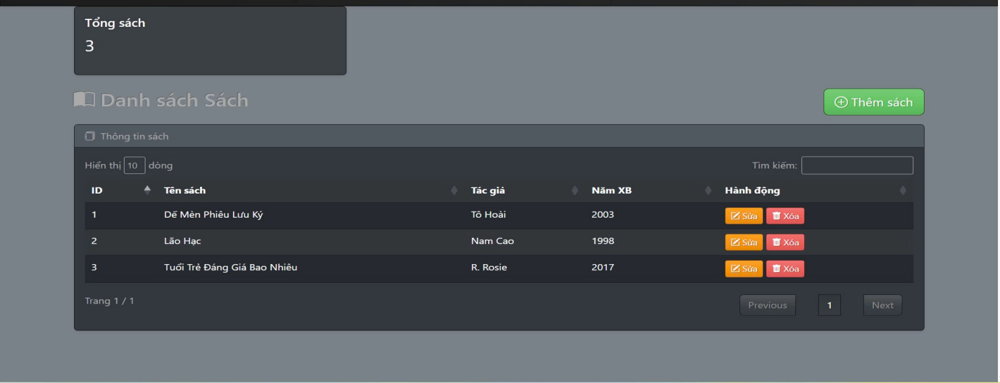
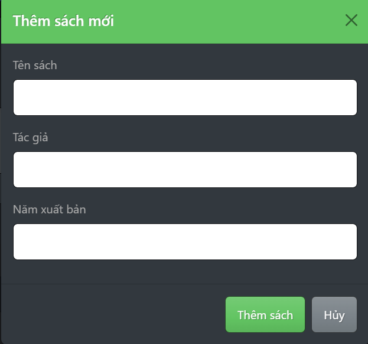
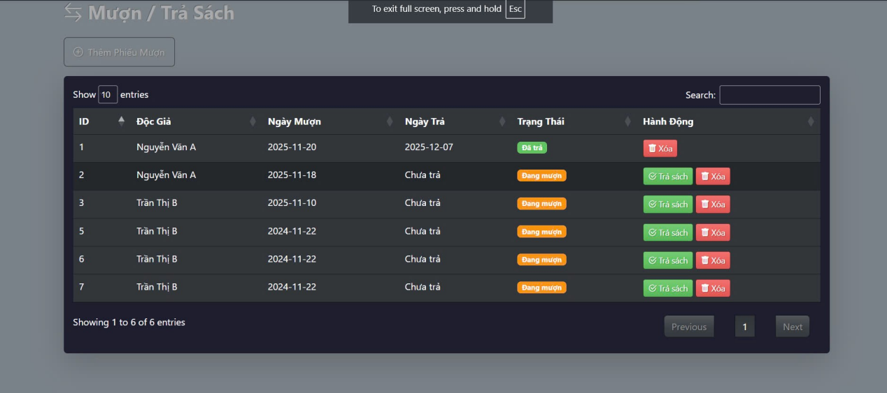
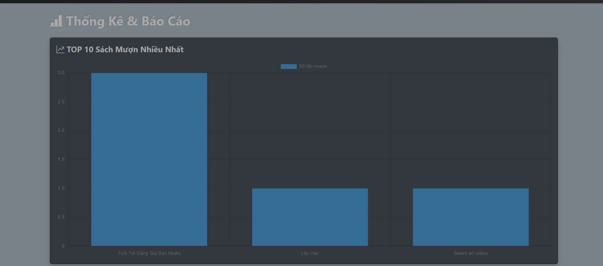

# Dự án docgia_app

Ứng dụng quản lý độc giả, hỗ trợ lưu trữ và quản lý thông tin người mượn sách.

## Chức năng chính
- Thêm độc giả
- Cập nhật thông tin độc giả
- Xóa độc giả
- Quản lý dữ liệu bằng MySQL

## Công nghệ sử dụng
- PHP (Laravel)
- MySQL

## Hướng dẫn cài đặt và chạy
1. Clone project về máy:
   ```bash
   git clone <link-repo>

Cài đặt dependencies:

composer install

Tạo file môi trường:

cp .env.example .env
Cấu hình database trong file .env

Generate key:

php artisan key:generate
Import database:
Sử dụng file: Dump20251210.sql trong thư mục database

Chạy migrate (nếu có):

php artisan migrate

Chạy ứng dụng:

php artisan serve
 Ghi chú
Dự án được thực hiện nhằm mục đích học tập và thực hành phát triển ứng dụng web.

## Hình ảnh
### Danh sách sách


### Thêm sách


### Quản lý phiếu mượn


### Thống kê

